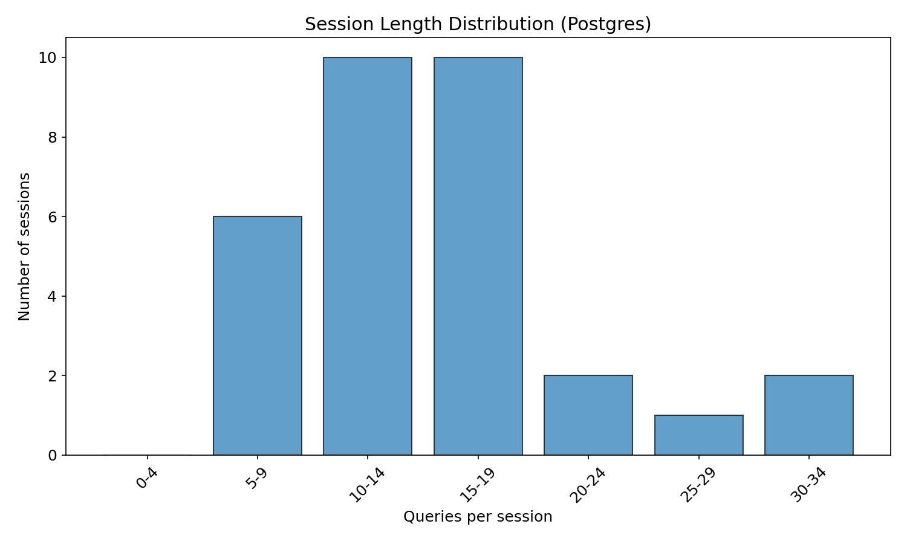
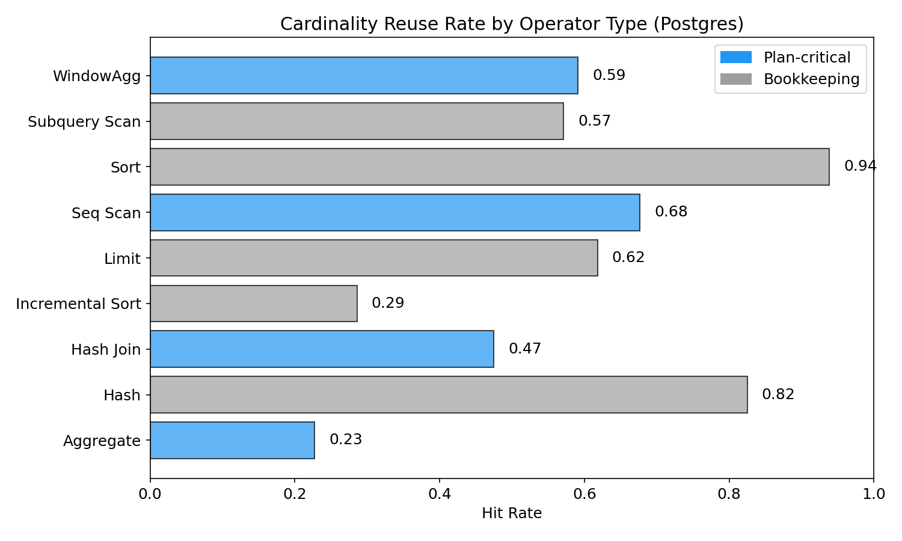
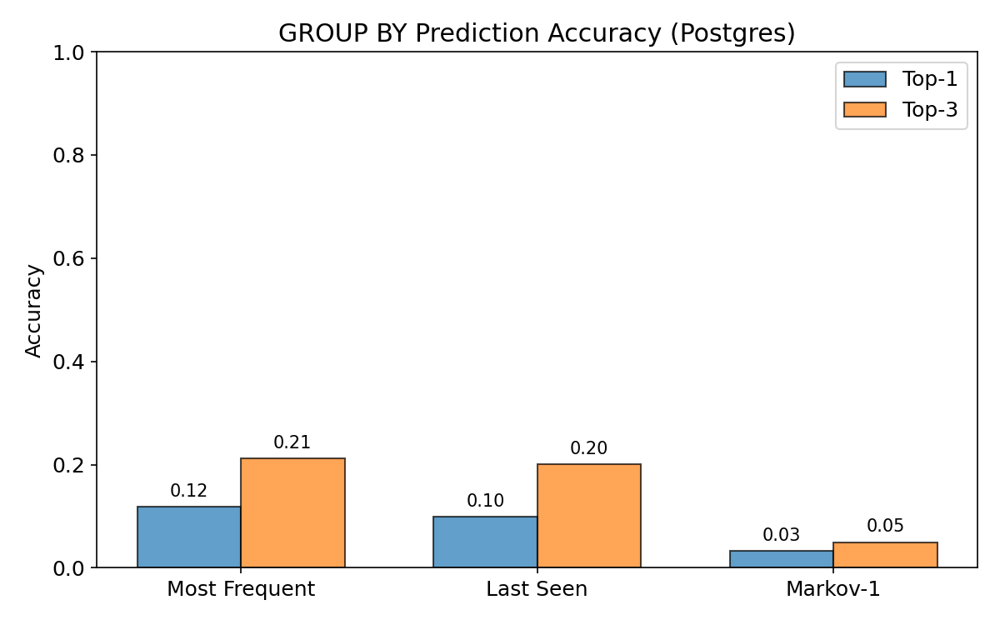

# Stage 2: Postgres Baseline — 31-Task Workload Characterization
**Generated:** 2026-04-12
**Engine:** PostgreSQL 16 with pg_hint_plan 1.6.1
**Agent:** Fresh Postgres-dialect ReAct agent (claude -p --model sonnet)
**Source of truth:** `stage2/stage2_metrics.json`

## Sweep Summary
- **Sessions:** 31 succeeded, 0 failed, 31 attempted
- **Total queries logged:** 465
- **Wall-clock duration:** 7143s (2.0h)
- **Max queries/session:** 40

**Per-task results:**
| Task | Status | Queries | Wall Clock (s) |
|------|--------|---------|----------------|
| flag-1 | done | 9 | 120.2 |
| flag-2 | done | 10 | 159.1 |
| flag-3 | done | 8 | 112.4 |
| flag-4 | done | 11 | 147.3 |
| flag-5 | done | 16 | 255.8 |
| flag-6 | done | 13 | 180.4 |
| flag-7 | done | 7 | 95.6 |
| flag-8 | done | 9 | 105.7 |
| flag-9 | done | 18 | 271.2 |
| flag-10 | done | 6 | 114.4 |
| flag-11 | done | 21 | 334.6 |
| flag-12 | done | 12 | 159.5 |
| flag-13 | done | 16 | 216.3 |
| flag-14 | done | 17 | 244.4 |
| flag-15 | done | 14 | 180.3 |
| flag-16 | done | 16 | 242.9 |
| flag-17 | done | 17 | 238.5 |
| flag-18 | done | 13 | 183.6 |
| flag-19 | done | 32 | 509.7 |
| flag-20 | done | 30 | 454.7 |
| flag-21 | done | 21 | 293.8 |
| flag-22 | done | 12 | 196.2 |
| flag-23 | done | 10 | 126.4 |
| flag-24 | done | 25 | 535.3 |
| flag-25 | done | 16 | 372.6 |
| flag-26 | done | 15 | 207.4 |
| flag-27 | done | 7 | 96.2 |
| flag-28 | done | 16 | 224.1 |
| flag-29 | done | 13 | 165.6 |
| flag-30 | done | 21 | 340.5 |
| flag-31 | done | 14 | 258.4 |

## Structural Characterization (Group A)

| Metric | Mean | 95% CI | Median | Min | Max | N |
|--------|------|--------|--------|-----|-----|---|
| Table Jaccard | 0.956 | [0.940, 0.972] | 1.000 | 0.000 | 1.000 | 428 |
| Column Jaccard (select_cols) | 0.510 | [0.490, 0.529] | 0.500 | 0.000 | 1.000 | 428 |
| Column Jaccard (where_cols) | 0.620 | [0.586, 0.651] | 0.667 | 0.000 | 1.000 | 428 |
| Column Jaccard (groupby_cols) | 0.269 | [0.237, 0.303] | 0.000 | 0.000 | 1.000 | 428 |
| Template repetition | 0.002 | [0.000, 0.007] | 0.000 | 0.000 | 0.071 | 31 |
| Inter-query gap (s) | 14.026 | [13.505, 14.578] | 12.103 | 7.441 | 40.711 | 438 |
| Session length | 14.806 | [12.871, 17.161] | 14.000 | 6.000 | 32.000 | 31 |

## Opportunity Quantification (Group B)

### Result Cache Hit Rate
- **Hit rate:** 0.103 (44/428 queries)
- **95% CI:** [0.075, 0.133]
- **Mean rows saved on hits:** 45

### Cardinality Reuse Rate (Headline Metric)
- **Plan-critical hit rate:** 0.475 (488/1028 nodes)
- **Bookkeeping hit rate:** 0.875 (559/639 nodes)
- **Overall hit rate:** 0.628 (1049/1671 nodes)
- **Hintable hit rate (scans + joins):** 0.658 (364/553 nodes)

Plan-critical operators: Aggregate, Bitmap Heap Scan, Bitmap Index Scan, GroupAggregate, Hash Join, HashAggregate, Index Only Scan, Index Scan, Merge Join, MixedAggregate, Nested Loop, Seq Scan, WindowAgg

Bookkeeping operators: Append, CTE Scan, Gather, Gather Merge, Hash, Incremental Sort, Limit, Materialize, Memoize, Merge Append, Result, SetOp, Sort, Subquery Scan, Unique

**By operator type:**
| Operator | Hits | Total | Hit Rate | Class |
|----------|------|-------|----------|-------|
| Aggregate | 98 | 431 | 0.227 | plan-critical |
| Hash | 33 | 40 | 0.825 | bookkeeping |
| Hash Join | 19 | 40 | 0.475 | plan-critical |
| Incremental Sort | 4 | 14 | 0.286 | bookkeeping |
| Limit | 34 | 55 | 0.618 | bookkeeping |
| Materialize | 3 | 5 | 0.600 | bookkeeping |
| Nested Loop | 2 | 6 | 0.333 | plan-critical |
| ProjectSet | 2 | 3 | 0.667 | bookkeeping |
| Result | 2 | 3 | 0.667 | bookkeeping |
| Seq Scan | 343 | 507 | 0.677 | plan-critical |
| Sort | 474 | 505 | 0.939 | bookkeeping |
| Subquery Scan | 8 | 14 | 0.571 | bookkeeping |
| WindowAgg | 26 | 44 | 0.591 | plan-critical |

### Q-error on Reuse Hits
- **Plan-critical:** mean=3.05 median=1.00 P95=10.62 (N=487)
- **All operators:** mean=8.15 median=1.00 P95=38.19 (N=1046)
- **After reuse:** 1.0 (exact — using measured actual cardinality)

### GROUP BY Prediction Accuracy
N = 364 predictions

| Predictor | Top-1 | Top-3 |
|-----------|-------|-------|
| Most Frequent | 0.118 | 0.212 |
| Last Seen | 0.099 | 0.201 |
| Markov-1 | 0.033 | 0.049 |

## Move Sequences and Anchors (Group C)

**Move type frequencies:**
| Move | Count | Fraction |
|------|-------|----------|
| pivot | 263 | 0.573 |
| widen | 51 | 0.111 |
| other | 44 | 0.096 |
| drill_down | 39 | 0.085 |
| cross_table | 29 | 0.063 |
| reframe | 17 | 0.037 |
| deepen | 9 | 0.020 |
| overview | 7 | 0.015 |

**Top bigrams:**
| Sequence | Count |
|----------|-------|
| pivot → pivot | 164 |
| widen → pivot | 34 |
| pivot → widen | 32 |
| drill_down → pivot | 26 |
| other → pivot | 22 |
| pivot → drill_down | 18 |
| cross_table → cross_table | 15 |
| other → drill_down | 13 |
| pivot → other | 13 |
| pivot → reframe | 9 |

**Top trigrams:**
| Sequence | Count |
|----------|-------|
| pivot → pivot → pivot | 103 |
| pivot → pivot → widen | 22 |
| pivot → widen → pivot | 22 |
| widen → pivot → pivot | 20 |
| other → pivot → pivot | 18 |
| drill_down → pivot → pivot | 17 |
| pivot → drill_down → pivot | 12 |
| other → drill_down → pivot | 11 |
| pivot → other → pivot | 10 |
| pivot → pivot → drill_down | 10 |

**Anchor dimensions (≥50% of GROUP BYs):**
| Session | Anchors |
|---------|---------|
| flag-10_rep_a | TIMESTAMP_TRUNC(opened_at, MONTH) |
| flag-12_rep_a | assigned_to |
| flag-13_rep_a | TIMESTAMP_TRUNC(opened_at, MONTH) |
| flag-15_rep_a | assigned_to |
| flag-16_rep_a | model_category |
| flag-17_rep_a | department |
| flag-19_rep_a | department |
| flag-1_rep_a | category |
| flag-23_rep_a | user |
| flag-24_rep_a | department |
| flag-27_rep_a | manager |
| flag-28_rep_a | department |
| flag-29_rep_a | priority |
| flag-2_rep_a | TIMESTAMP_TRUNC(opened_at, MONTH) |
| flag-30_rep_a | department |
| flag-3_rep_a | assigned_to |
| flag-4_rep_a | TIMESTAMP_TRUNC(opened_at, MONTH), assigned_to |
| flag-6_rep_a | assigned_to |
| flag-8_rep_a | TIMESTAMP_TRUNC(opened_at, MONTH) |

## Cross-Engine Comparison (Postgres vs DuckDB)

DuckDB numbers from `/scratch/agentic-sql/reports/sweep_20260411.md`.

| Metric | DuckDB | Postgres | Notes |
|--------|--------|----------|-------|
| Table Jaccard | 0.931 | 0.956 | Both high — single-table tasks dominate |
| Column Jaccard (where) | 0.640 | 0.620 | |
| Column Jaccard (groupby) | 0.296 | 0.269 | Low on both — agents pivot rapidly |
| Template repetition | 0.001 | 0.002 | Both ~0 — agents never reissue identical SQL |
| Result cache hit rate | 0.147 | 0.103 | |
| **Card. reuse (plan-critical)** | **0.748** | **0.475** | 27pp gap is semantic, not cosmetic (see predicate_pair_analysis.md) |
| Card. reuse (overall) | 0.886 | 0.628 | Overall inflated by bookkeeping on both engines |
| Hintable reuse (scans+joins) | — | 0.658 | Postgres-specific: what pg_hint_plan can target |
| Q-error plan-critical (mean) | 5.91 | 3.05 | |
| Q-error plan-critical (P95) | — | 10.62 | |
| Session length (mean) | 10.3 | 14.8 | Postgres agent runs longer sessions |
